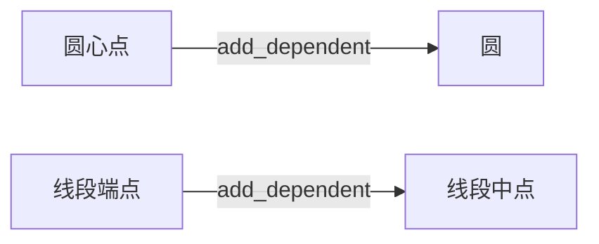

# API v2 架构文档

---

## 1. 设计目标
构建一个支持 **动态参数化构造** 和 **自动级联更新** 的几何图形系统，具备以下特性：
- **灵活构造**：支持多种几何对象构造方式（如圆心+半径、三点共圆、对称点等）  
- **依赖感知**：自动追踪几何对象间的依赖关系（如圆依赖其圆心点）  
- **实时更新**：当基础对象（如点/线）变动时，所有依赖对象（如圆/交点）自动重新计算  
- **类型安全**：通过严格参数校验确保几何逻辑的合法性

---

## 2. 核心组件

### 2.1 `BaseGeometry` 基类
**定位**：所有几何对象的公共基类  
**核心职责**：
```python
class BaseGeometry:
    # 公共属性
    name: str          # 对象标识名称
    dependents: List   # 依赖此对象的其他几何对象列表
    
    # 关键方法
    def add_dependent(self, obj):
        """注册依赖对象（如圆注册其圆心点为依赖）"""
        
    def board_update_msg(self):
        """广播更新信号至所有依赖对象"""
        
    def update(self):
        """执行参数重计算与属性绑定"""
```

### 2.2 `GeometryAdapter` 适配器
**定位**：构造逻辑的抽象封装层  
**核心设计**：
```python
class GeometryAdapter:
    construct_type: str  # 构造类型标识符（如"PR"/"PPP"）
    
    def __call__(self, *objs):
        """根据 construct_type 执行具体构造逻辑"""
        
    def bind_attributes(self, target, attrs):
        """将计算结果注入目标几何对象属性"""
```

---

## 3. 具体实现模式

### 3.1 圆（Circle）的实现
**适配器逻辑**：
```python
class CircleAdapter(GeometryAdapter):
    def __call__(self, *objs):
        match self.construct_type:
            case "PR":   # 圆心+半径
                self.center = objs[0].coord
                self.radius = objs[1]
            case "PPP":  # 三点共圆
                self.center, self.radius = three_points_circle(...)
            # 其他构造方式...
```

**对象定义**：
```python
class Circle(BaseGeometry):
    attrs = ["center", "radius", "area"]  # 声明需要绑定的属性
    def __init__(self, construct_type, *objs):
        self.adapter = CircleAdapter(construct_type, self, *objs)
```

### 3.2 点（Point）的实现
**复杂构造示例**：
```python
# 交点适配器逻辑（IntersectionLL 构造方式）
def __call__(self, *objs):
    line1, line2 = objs[0], objs[1]
    self.coord = intersection_line_line(line1, line2)

# 双交点对象（Points2）
class Points2(BaseGeometry):
    attrs = ["coord1", "coord2"]  # 同时绑定两个坐标
```

---

## 4. 依赖与更新机制

### 4.1 依赖关系建立


### 4.2 更新传播流程
```python
# 当圆心点移动时：
圆心点.update() 
  → 触发 circle.board_update_msg() 
  → 圆执行 adapter 重新计算半径/面积 
  → 圆触发其依赖对象（如切线）更新
```

---

## 5. 工厂函数体系

### 5.1 核心设计原则
- **命名直观**：`PointMidPP`（两点中点）、`Points2IntersectionCirCir`（两圆交点）  
- **参数强类型**：使用 `Point`/`LineLike` 等类型标注  
- **文档集成**：每个函数包含 Markdown 格式的参数说明

### 5.2 典型函数示例
```python
def PointVerticalPL(point: Point, line: LineLike, name: str = ""):
    """
    ## 构造垂足点
    - `point`: 原始点坐标
    - `line`: 目标直线/线段
    - 返回: 垂足点对象
    """
    return Point("VerticalPL", point, line, name=name)
```

---

## 6. 使用示例

### 6.1 基础构造
```python
# 构造自由点
A = PointFree(np.array([1,2]))
B = PointFree(np.array([4,5]))

# 构造两点中点
M = PointMidPP(A, B)

# 构造圆心+半径圆
C = CirclePR(A, 3.0)
```

### 6.2 动态更新
```python
# 当移动点A时：
A.coord = np.array([2,3]) 
A.update()  # 自动触发圆C和中点M的重新计算
```

---

## 7. 架构优势

| 优势                | 说明                          |
|---------------------|-----------------------------|
| 构造逻辑解耦        | 适配器模式隔离不同构造方式的实现细节 |
| 动态响应系统        | 依赖链支持任意深度的级联更新      |
| 类型安全            | GeoUtils.check_params 验证参数类型 |

---

# API v1 文档（过时）

---

#### **基础类型**
- **`PointLike`**：几何点基类，派生子类如自由点、约束点等
- **`LineLike`**：几何线基类，包含线段、射线、直线等派生类
- **`ParamLike`**：参数基类（如角度、向量）

`PointLike` 具有 `coord` 属性，表示点坐标

`LineLike` 具有 `start` 与 `end` 属性，表示生成该线的两个点

---

#### **点构造**
- **`AxisymmetricPointPL(point, line, name)`**：点关于直线的对称点
- **`ConstraintPoint(coord, constraint, name)`**：约束点（坐标由父约束确定）
- **`ExtensionPointPP(start_point, through_point, name)`**：两点延长线上的点
- **`FreePoint(coord, name)`**：自由点（坐标固定）
- **`IntersectionPointCirCir(circle1, circle2, name)`**：两圆交点
- **`IntersectionPointLCir(line, circle, name)`**：线与圆交点
- **`IntersectionPointLL(line1, line2, name)`**：两线交点
- **`InversionPointPCir(circle, point, name)`**：点关于圆的反演点
- **`MidPointL(line, name)`**：线段中点
- **`MidPointPP(point1, point2, name)`**：两点中点
- **`ParallelPointPL`**：点相对直线的平行点
- **`RotationPointPPA(point, center, angle, name)`**：绕中心点旋转后的点
- **`TranslationPointP(point, vector, name)`**：点沿向量平移后的点
- **`VerticalPointPL(point, line, name)`**：点在直线上的垂足

---

#### **线构造**
- **`LineSegmentPP(start, end, name)`**：两点线段
- **`RayPP(start, end, name)`**：两点射线
- **`InfinityLinePP(start, end, name)`**：两点确定的无限直线

---

#### **角度构造**
- **`AngleLL(angle, line1, line2, name)`**：两线角
- **`AngleLP(angle, line, point, name)`**：线绕基点角
- **`AnglePP(angle, point1, point2, name)`**：两点绕基点角度

---

#### **圆锥曲线**
- **`CircleP(center, radius, name)`**：圆心+半径构造圆
- **`CirclePP(center, point, name)`**：圆心+圆上一点构造圆
- **`CirclePPP(point1, point2, point3, name)`**：三点外接圆
- **`EllipseAB(center, x_point, y_point, name)`**：轴点构造椭圆
- **`EllipseCE(center, focal_point, eccentricity, name)`**：中心+焦点+离心率构造椭圆
- **`HyperbolaAB(center, x_point, y_point, name)`**：轴点构造双曲线
- **`HyperbolaCE(center, focal_point, eccentricity, name)`**：中心+焦点+离心率构造双曲线
- **`Parabola(center, focal_point, name)`**：焦点构造抛物线

---

#### **组合操作**

组合操作基于一系列几何操作，除了结果本身还会返回过程中的一些构造对象，具体请查阅源码

- **`AngleBisectorLL(line1, line2, sort, name)`**：作两直线的角平分线（按锐角、钝角排序）。
- **`CentroidPPP(point1, point2, point3, name)`**：计算三角形重心（三中线交点）。
- **`CircumcenterCir(circle, name)`**：通过外接圆三点计算圆心（见 `CircumcenterPPP`）。
- **`CircumcenterPPP(point1, point2, point3, name)`**：计算三角形外心（垂直平分线交点）。
- **`MultiplicationLineLL`**：尺规作一根线段，其长度为 line1 的 line2 倍
- **`OrthocenterPPP(point1, point2, point3, name)`**：计算三角形垂心（三高线交点）。
- **`ParallelLineLP(line, point, radius_out)`**：尺规作一根过 point 直线，平行于 line
- **`PerpendicularBisectorInfiniteLinePP(point1, point2, name)`**：作两点的垂直平分线。
- **`PolarInfiniteLineCirP(circle, point, name)`**：作圆外极点对应的极线。
- **`PolePointCirL(circle, line, name)`**：作圆内极线对应的极点。
- **`SqrtLineL(line, name)`**：尺规作指定线段的算数平方根线段
- **`TangentLineCirCir(circle1, circle2, name)`**：作两圆的切线（若两圆相切则作切线，否则作平行线）。
- **`TangentLineCirP(circle, point, name)`**：作圆上一点的切线（若点不在圆上则作平行线）。
- **`TangentLineCirP2(circle, point, name)`**：尺规作过圆外一点的两条切线。
- **`VerticalInfinieLinePL(point, line, name)`**：过一点作直线的垂线。

---

#### **依赖与更新**

几何对象（如点、线）的修改会自动触发依赖对象的更新

---

#### **示例**
```python
# 构造三角形重心
point1 = FreePoint([0,0], "A")
point2 = FreePoint([2,0], "B")
point3 = FreePoint([1,3], "C")
centroid, _ = CentroidPPP(point1, point2, point3, "重心")

# 构造垂线
line = LineSegmentPP(point1, point2, "底边")
vertical_line, _ = VerticalInfinieLinePL(point3, line, "高线")
```

---

## develop 说明

### 成员变量定义

在定义**原始值**（非几何对象）时，如果该值有变更需要，应该加入 `_` 前缀并给出相应的 getter & setter

但是在 setter 中可以不必传递更新信息，因为 `_recalculate` 中使用到该值的一定是 setter 给定的最新值

setter 中的 `self.update()` 仅用于向 `_recalculate` 中的其它对象传递更新通知

如果依赖的是**几何对象**，可以不使用前缀，也不需要 getter & setter

### 成员变量在 `_recalculate` 中的使用

在 `_recalculate` 中成员变量的写入应该使用原始变量，即带有 `_` 前缀的变量

因为当前实例在进入重计算方法前就已经标记为更改了，不需要通过包装方法进一步通知

然而其它几何对象成员的读取就应该使用包装方法，防止因懒更新读取到过期值

### 关于组合作图

有一些机制需要通过组合作图而非单个构造对象

e.g.

做出过一点的平行线，需要先用 `ParallelPointPL` 做出过一点的平行点，然后再作过两点的直线

这个过程将通过方法机制简化

### 异常机制

如果发生异常，例如**交点消失**等，事件传递应当在对应层级终止，但不影响其它不相关事件传递

在前端应该可选择体现为**整体更新暂停**或**对应部分暂时隐藏**